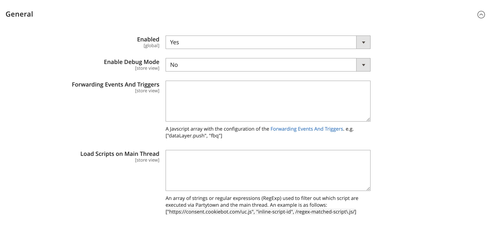
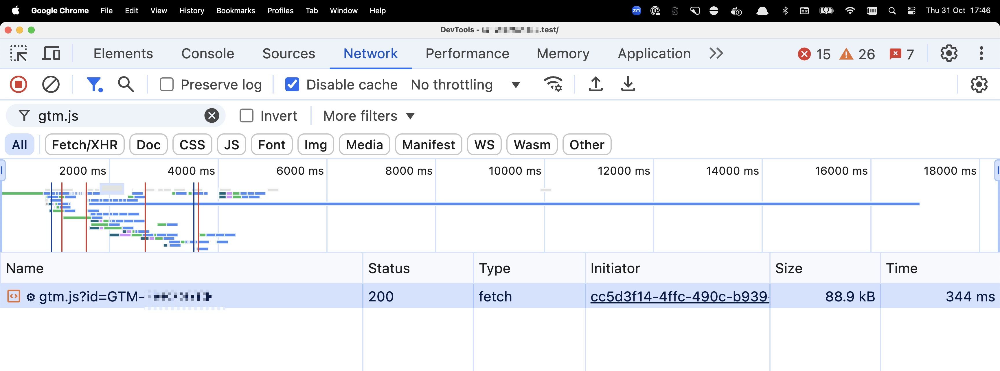

# Rossmc Partytown

[](https://packagist.org/packages/rossmc/magento2-partytown)     

Magento 2 module to run scripts such as GTM off main thread using [partytown](https://partytown.builder.io/).

**Performance Benefits**
- [Reduced main thread work](https://developer.chrome.com/docs/lighthouse/performance/mainthread-work-breakdown)
- [Reduce JavaScript execution time](https://developer.chrome.com/docs/lighthouse/performance/bootup-time/)
- [Fewer render-blocking resources](https://developer.chrome.com/docs/lighthouse/performance/render-blocking-resources/)

> ⚠️ **Warning:** Please note that this module is still in development and has not been tested fully. Partytown is not a one-size-fits-all solution and depending on which third-party scripts you are loading and how you may need to adjust the configuration. For example if new tags or scripts are added to GTM you may need to adjust the _Load Scripts on Main Thread_ configuration. See the [partytown documentation](https://partytown.builder.io/) for more information. 

## Installation
```bash
composer require rossmc/magento2-partytown
```

## Configuration


### Uninstalling the Service Worker
After disabling the module, you can use the configuration option to _Unregister Partytown Service Worker_. This helps remove the service worker from user's browser to prevent the cached service worker from interfering.

## Usage
Once you have enabled and configured the module you can load scripts with Partytown off the main thread by adding `type="text/partytown"` to the script tag. 
See [here](https://partytown.builder.io/html) for more information on how to use partytown.      
GTM for example:
```html
<script type="text/partytown">(function(w,d,s,l,i){w[l]=w[l]||[];w[l].push({'gtm.start':
new Date().getTime(),event:'gtm.js'});var f=d.getElementsByTagName(s)[0],
j=d.createElement(s),dl=l!='dataLayer'?'&l='+l:'';j.async=true;j.src=
'https://www.googletagmanager.com/gtm.js?id='+i+dl;f.parentNode.insertBefore(j,f);
})(window,document,'script','dataLayer','GTM-XXXXXX');</script>
<!-- End Google Tag Manager -->
```

> **Note:** _Forwarding Events And Triggers_ must be configured for GTM to work properly.

You will see your scripts loading with the updated `type="text/partytown-x"` tag in the source code.


In the Chrome DevTools Network tab you will see the gear icon by the file name to indicate the GTM script was loaded by the partytown service worker.      


And in the Sources panel, you will see the partytown threads.

## Customising in your project
If you need to override the configuration or change the partytown version you can do so by overriding them in your project. To regenerate the partytown files you can run the following commands:
```bash
npm install
npm run copylib
```
